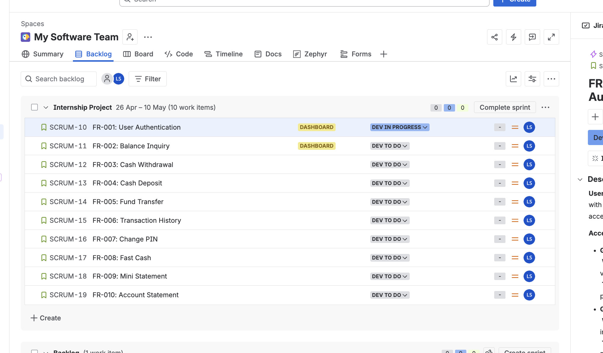

# 🧩 Agile / Scrum Workflow Documentation

## 📌 Project Management Overview

This QA project followed an Agile/Scrum-style workflow using Jira backlog management.

The backlog included functional requirements for core ATM features including:

- User Authentication
- Balance Inquiry
- Cash Withdrawal
- Cash Deposit
- Fund Transfer
- Transaction History
- Change PIN
- Fast Cash
- Mini Statement
- Account Statement

---

## 🧪 QA Testing Alignment

Each functional requirement was reviewed from a QA perspective to support:

- Exploratory testing
- Functional validation
- Boundary testing
- User story verification
- Defect identification

---

## 📸 Jira Backlog Evidence

---

## 🧠 Skills Demonstrated

- Agile/Scrum familiarity
- Jira backlog navigation
- Functional requirement analysis
- QA documentation
- User story understanding
