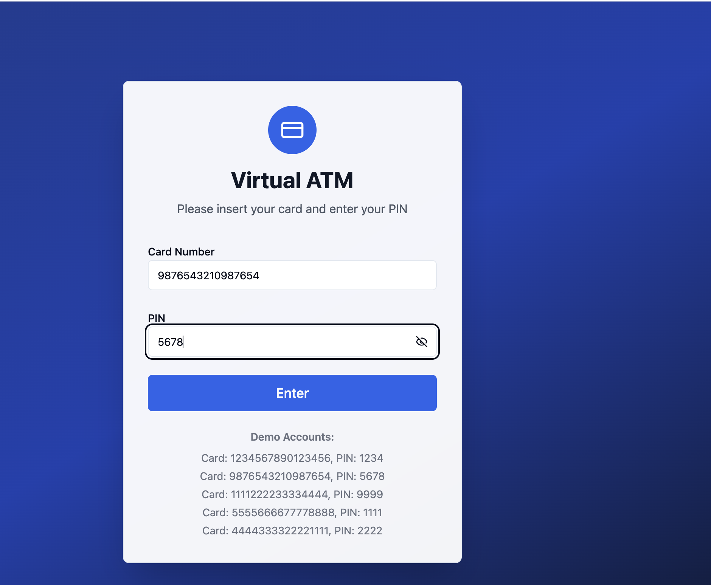
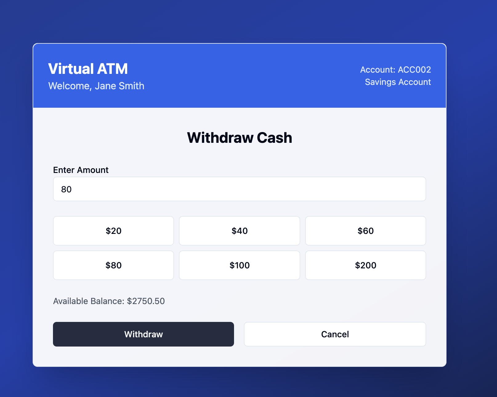
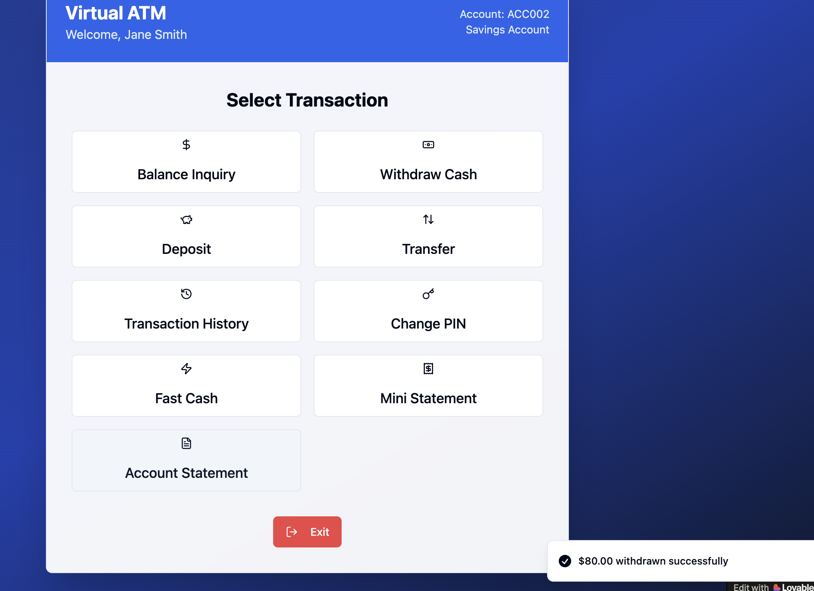

# 🧪 Exploratory Testing Notes – ATM System

## 🔍 Testing Session 1: Login

### Observations:
- Tested empty input fields → system behavior inconsistent
- Entered special characters in PIN field
- Entered less than 4 digits for PIN

### Expected vs Actual:
- Expected: PIN should always require 4 digits
- Actual: System allowed fewer than 4 digits in some cases

📸 Screenshot: login.png

---

## 💸 Withdrawal Testing

### Observations:
- Entered negative values
- Entered very large numbers
- Left amount field blank

### Issues:
- System did not always validate boundary values correctly

📸 Screenshot: withdrawal.png

